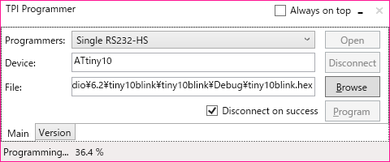
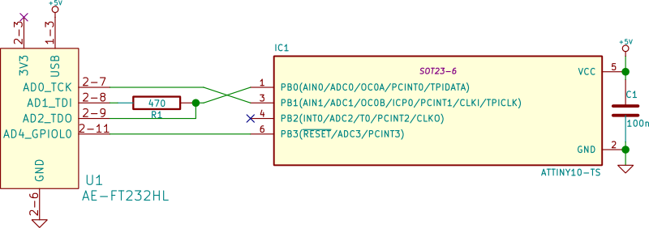
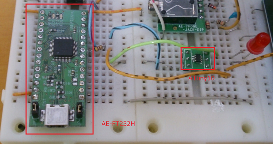

Visual Studio Update1以降インストール後にAtmel Studio 7が起動できない問題の解決方法
==============================================================================

概要
------
Atmel Studio 7.0をインストールした後でVisual Studio Update1をインストールすると、

`ソースコード <https://github.com/ciniml/TpiProgrammer>`_ および `バイナリ <https://github.com/ciniml/TpiProgrammer/releases>`_ は `GitHub上 <https://github.com/ciniml/TpiProgrammer>`_ に置いてある。

ATtiny10の書き込みインターフェース(TPI)
---------------------------------
上位クラスのAVRがSPIにより書き込みを行うのと異なり、ATtiny10はTPIと呼ばれる2線式のインターフェースで書き込みを行う。

各信号線の名称と役割を次に示す。

* TPICLK - クロック
    
    * マスターが制御
    
* TPIDATA - データ
    
    * TPICLKの立ち上がりでラッチ
    * 半二重通信
    * フレーム単位で方向切り替え

TPIは1オクテットのフレーム単位でやりとりをするようになっている。以下にフレームの構造を示す。

フレーム内のシンボルの意味は次の通りである：

====== ============================
名前     内容
====== ============================
ST      スタートビット('0')
D0-D7   1オクテットのデータ(LSBファースト)
P       データの偶パリティ
SP1     ストップビット1('1')
SP2     ストップビット2('1')
====== ============================
    
余談であるが、フレーム構造はATmega系のUSARTのクロックあり、パリティあり、ストップ2bitの設定と同じとなっている。
ATtiny10にはUSARTどころかUARTすらないが…

TPIDATAの送受信方向はフレーム単位で上位層の通信内容に応じて切り替えられる。

連続するフレーム間で送受信方向が切り替わる際には、0～128クロック分のガードタイムが挿入される。ガードタイムの長さは設定により変更可能であるが、TPIのセッション開始時には128クロックに初期化される。

ガードタイム:

    * データの送受信方向切り替え時に挿入
    * 0～128クロック分、変更可能
    * TPIセッション開始時は128クロック
    

FT232Hの信号とTPI
------------------
FT232HはFTDIのUSB-UART/FIFO変換ICである。よく似た名前のICとして同社のFT232Rがあるが、FT232HはFT232Rと異なり、MPSSEと呼ばれるJTAGなどの複雑なクロック同期式信号をやりとりする機能を持っている。
今回はこのMPSSEを用いてTPIで通信を行う。

FT232Hのチップ単体でも秋月で売っているが、今回はブレッドボードで使いたいため、秋月のFT232HLモジュールである `AE-FT232HL <http://akizukidenshi.com/catalog/g/gK-06503>`_ を使用した。

以下にAE-FT232HLとATtiny10の接続を示す。

FT232H側の信号の内容は次の通りである：

======= =================
名前      内容
======= =================
TCK      クロック信号
TDI      マスター側データ出力
TDO      マスター側データ入力
GPIOL0   GPIO
======= =================

TPIはTPIDATAにて双方向通信を行うのに対し、FT232H側はTDI/TDOでそれぞれ送信、受信を行う。
このような場合、トライステートバッファを用いることが多いが、今回は簡単にTDIに抵抗を接続し、ATtiny10からの出力とFT232Hからの出力が競合しないようにする。

GPIOL0はATtiny10のリセット信号(#RESET)を操作するために用いる。ここで、#RESETの閾値は0.9Vccとなっており、FT232Hの3.3[V]では'HIGH'と認識される電圧を下回る。
#RESETはATtiny10内蔵のプルアップ抵抗が接続されているので、FT232H側はHi-Zとすることにより、#RESETを'HIGH'にする。

FT232Hの制御
-------------

制御に用いるライブラリ
~~~~~~~~~~~~~~~~

FT232Hを制御するためのライブラリとして主に

* FTD2XX - FTDI公式のライブラリ
* libftdi - libusbベースのライブラリ

の2つがある。

前者はFTDI公式の.NET向けのラッパーである FTD2XX_NET.dll が用意されており、
.NET上で動かすのであればこれを用いるのが簡単である。
但し、内部でLoadLibraryなどをよびだしてP/Invokeしているので、Linux上のMono等では動かない。

後者は libusb を用いたオープンソースの実装である。Linux上で動かしたいのならこちらを選択すると良い。
但し、CLI向けのラッパーなどは存在しないので、自分でP/Invokeで呼び出さなければならない。

今回は、

* (多分やらないと思うが)Linux上でも動かすかもしれない。
* FTD2XXのバイナリをGitHub上のリポジトリに突っ込んでおいていいのかライセンスがよく分からない
    
    * 気が向いたらlibftdiラッパーをNuGetパッケージ化したい(需要があるかしらんけど)

という理由で、後者のlibftdiを用いる方法で実装した。

MPSSE
~~~~~~

FT232Hには *MPSSE* という、クロック同期シリアル信号による通信を行うための機能がついている。
MPSSEでは、コマンドを送信することにより、オクテット単位やビット単位でのデータの入出力や現在の各ポートの値の読み取りや書き込みと行った操作を行うことが出来る。クロックのどちらのエッジで値の入出力を行うのかなども指定できる。

TPIのフレームは ST+D[0-7]+P+SP1+SP2 の12ビットで構成されるので、オクテット単位とビット単位のデータ入出力を組み合わせることによりフレームの入出力が可能となる。

MPSSEのコマンドの仕様はFTDIの `アプリケーションノート AN_108 <http://www.ftdichip.com/Support/Documents/AppNotes/AN_108_Command_Processor_for_MPSSE_and_MCU_Host_Bus_Emulation_Modes.pdf>`_ に詳しく書いてあるので参考にすると良い。

また、今回作成したプログラムの中では、 `MpsseCommandクラス <https://github.com/ciniml/TpiProgrammer/blob/e640b35101eeace81fa8d9c2b6f509a1c83bd0e3/TpiProgrammer/Model/TpiCommunication.cs#L139>`_ がMPSSEのコマンドの構築を行っているので、こちらも合わせて見ると参考になるかもしれない。

確認
-----

とりあえずAE-FT232Hを使ってATtiny10にプログラムを書き込んで、Lチカ出来ることを確認した。

参考
-------

ATtiny4/5/9/10 [DATASHEET]
    http://www.atmel.com/ja/jp/Images/Atmel-8127-AVR-8-bit-Microcontroller-ATtiny4-ATtiny5-ATtiny9-ATtiny10_Datasheet.pdf

    Section 14のProgramming interfaceと、Section 15のMemory programmingにTPIの情報が載っている。

Application Note AN_108 Command Processor for MPSSE and MCU Host Bus Emulation Modes
    http://www.ftdichip.com/Support/Documents/AppNotes/AN_108_Command_Processor_for_MPSSE_and_MCU_Host_Bus_Emulation_Modes.pdf

Application Note AN_135 FTDI MPSSE Basics
    http://www.ftdichip.com/Support/Documents/AppNotes/AN_135_MPSSE_Basics.pdf

libFTDI - FTDI USB driver with bitbang mode
    http://www.intra2net.com/en/developer/libftdi/

libusb
    http://libusb.info/
