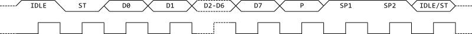

FT232HでATtiny10に書き込む
========================

概要
------
Atmel純正のJTAGICE3がなぜかATtiny10の書き込みに対応していないので、FT232Hを使ってATtiny10に書き込みが出来るプログラマを作ってみた。

.. image:: screenshot.png

ATtiny10の書き込みインターフェース
----------------------------
上位クラスのAVRがSPIにより書き込みを行うのと異なり、ATtiny10はTPIと呼ばれる2線式のインターフェースで書き込みを行う。

TPIはTPICLKと呼ばれるクロック信号とTPIDATAと呼ばれるデータ信号を持っており、TPICLKのクロックに同期してTPIDATAにて半二重通信を行う。
クロック信号はTPIのマスタであるプログラマが制御し、TPIDATAはタイミングに応じてマスタおよびデバイスの両方が制御する。

TPIは1オクテットのフレーム単位でやりとりをするようになっている。以下にフレームの構造を示す。

TPIDATAの信号は、TPICLKの立ち上がりでラッチされる。フレームの各信号の内容は次の通りである：

====== ============================
名前     内容
====== ============================
ST      スタートビット('0')
D0-D7   1オクテットのデータ(LSBファースト)
P       データの偶パリティ
SP1     ストップビット1('1')
SP2     ストップビット2('1')
====== ============================

TPIDATAの送受信方向はフレーム単位で上位層の通信内容に応じて切り替えられる。

余談であるが、このフレーム構造はAVRのUSARTのクロック同期あり、パリティあり、ストップビット2[bit]の設定そのものである。
ATtiny10にはUSARTが載っていないがなぜこのようなフォーマットになっているのかは不明である。

連続するフレーム間で送受信方向が切り替わる際には、0～128クロック分のガードタイムが挿入される。ガードタイムの長さは設定により変更可能であるが、TPIのセッション開始時には128クロックに初期化される。

FT232Hの信号とTPI
------------------
FT232HはFTDIのUSB-UART/FIFO変換ICである。よく似た名前のICとして同社のFT232Rがあるが、FT232HはFT232Rと異なり、MPSSEと呼ばれるJTAGなどの複雑なクロック同期式信号をやりとりする機能を持っている。
今回はこのMPSSEを用いてTPIで通信を行う。

FT232Hのチップ単体でも秋月で売っているが、今回はブレッドボードで使いたいため、秋月のFT232HモジュールであるAE-FT232Hを使用した。

以下にAE-FT232HとATtiny10の接続を示す。

.. image:: tpi_connection.png

FT232H側の信号の内容は次の通りである：

======= =================
名前      内容
======= =================
TCK      クロック信号
TDI      マスター側データ出力
TDO      マスター側データ入力
GPIOL0   GPIO
======= =================

TPIはTPIDATAにて双方向通信を行うのに対し、FT232H側はTDI/TDOでそれぞれ送信、受信を行う。
このような場合、トライステートバッファを用いることが多いが、今回は簡単にTDIに抵抗を接続し、ATtiny10からの出力とFT232Hからの出力が競合しないようにする。

GPIOL0はATtiny10のリセット信号(#RESET)を操作するために用いる。ここで、#RESETの閾値は0.9Vccとなっており、FT232Hの3.3[V]では'HIGH'と認識される電圧を下回る。
#RESETはATtiny10内蔵のプルアップ抵抗が接続されているので、FT232H側はHi-Zとすることにより、#RESETを'HIGH'にする。

FT232Hの制御
-------------
FT232Hを制御するためのライブラリとして主に

* FTDI公式のライブラリ（FTD2XX)
* オープンソースのlibusbベースのライブラリ(libftdi)

の2つがある。前者は公式で.NET向けのラッパーである FTD2XX_NET.dll が用意されており、これで問題なければ

次
----
やる気が続けばSERVICEの定義の説明をする．たぶん．