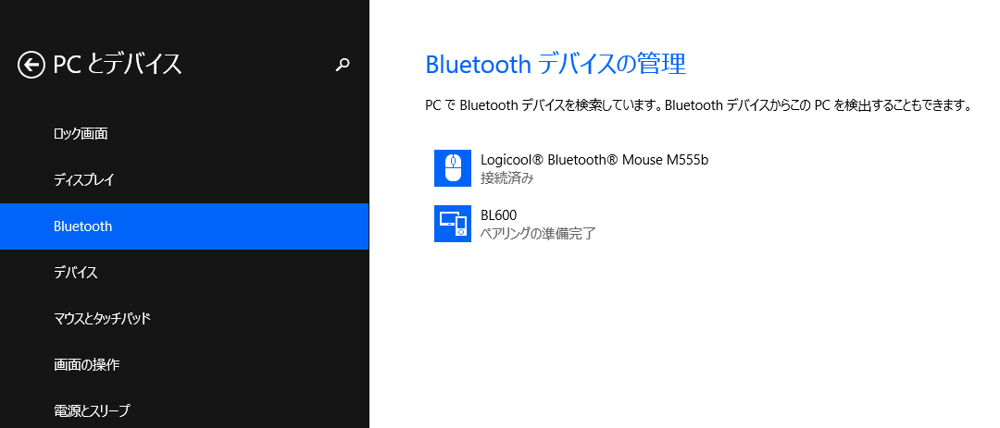

BL600でアドバタイズする
=======================

概要
------
BL600でセンサの値を読んでPCに送信してみたかったので，とりあえず独自のSERVICEを定義してセンサの値をGATTクライアントから読み取れるようにしてみた．
その中でまずはBL600でADVERTISEしてPCからスキャンした際に表示される部分までを説明する．

BL600とは
----------
Laird Technologies製の技適付きBluetooth Low Energyモジュール．￥1,500くらいでdigikeyなどで買える．
特に専用の書き込み器などを必要とせず，UART経由でsmart BASICなる言語で動作を記述できる．まさか世の中にsmartなBASICがあるとは思っていなかった．

Lairdのサイトのこのページからドキュメントやツール類がダウンロードできるが，最新のファームウェアやドキュメントをダウンロードするにはユーザー登録が必要．登録はこのページからできる．
smart BASIC
BL600の動作を記述するための専用言語．Windows上で動作する専用のコンパイラにより中間コードに変換した後，UART経由でBL600に転送し，BL600上の実行エンジンで実行する．
VBAのような構造化されたBASICなので，言うほど辛くは無い．VBA書けるならサラサラ書けると思われる．

文字列演算や算術演算用の関数に加えてBLEモジュールを扱うための専用関数が用意されていて，それなりに簡単にBLEモジュールを扱うことが出来る．

ADVERTISEする
-------------
とりあえずSERVICEを定義する前にまずPCからデバイスを見つけられるようにADVERTISEしてみる．
以下，smart BASICのコード::

    Dim rc  // result code
    Dim advReport$
    Dim scanReport$
    Dim peerAddr$
    
    // initialize services
    rc = BleGapSvcInit("BL600", 0, 256, 500000, 1000000, 4000000, 0)
    // start advertisement
    advReport$ = ""
    scanReport$ = ""
    peerAddr$ = ""
    rc = BleAdvRptInit(advReport$, 0x06, 1, 10)
    rc = BleAdvRptsCommit(advReport$, scanReport$)
    rc = BleAdvertStart(0, peerAddr$, 1000, 0, 0)
    
    // Wait events
    WaitEvent

BleGapSvcInit関数でGAPのDevice Name，Appearance，Peripheral Preferred Connection Parametersを設定する．ADVERTISEする前に呼び出しておかないとデフォルト値が使われてしまう．

関数のシグネチャは

BleGapSvcInit(ByRef deviceName AS STRING, ByVal nameWritable AS INTEGER, ByVal nAppearance AS INTEGER, ByVal nMinConnInterval AS INTEGER, ByVal nMaxConnInterval AS INTEGER, ByVal nSupervisionTimeout AS INTEGER, ByVal nSlaveLatency AS INTEGER)　AS INTEGER

となっている．とりあえず，deviceNameにADVERTISE時に表示したいデバイス名を指定する以外は適当に指定する．

次にBleAdvRptInit関数でADVERTISE用のデータ(Advertising Data)を構築する．smart BASICではバイト列もSTRINGとして扱われるが，ADVERTISEデータなどのバイト列を組み込み関数で構築するのが難しいため，BleAdvRptInitのようにデータを構築してSTRING型変数に格納する関数が多数用意されている．

BleAdvRptInit関数のシグネチャは次の通りである：

BleAdvRptInit(ByRef advRpt$ AS STRING, ByVal nFlagsAD AS INTEGER, ByVal nAdvAppearance AS INTEGER, ByVal nMaxDevName AS INTEGER) AS INTEGER

第1引数のadvRpt$に構築したAdvertising Dataを格納するSTRING型変数を指定する．
nFlagsADにはAdvertising DataのFlagsフィールドの値を指定する．とりあえずLE General Discoverable Mode(0x02)とBR/EDR Not Supported(0x04)をセットするので0x06としている．
nAdvAppearanceには1を指定して，Advertising DataにGAPのAppearanceの値を含めるようにする．
nMaxDevNameには10を指定して，Advertising Dataにデバイス名を10文字まで含めるようにしている．

これでAdvertising Dataが構築できたので，Advertising Dataを設定するためにBleAdvRptsCommit関数を呼び出す．

BleAdvRptsCommit関数のシグネチャは次の通りである：

BleAdvRptsCommit(ByRef advRpt$ AS STRING, ByRef scanRpt$ AS STRING) AS INTEGER

advRpt$にはAdvertising Dataを表すSTRINGを指定する．scanRpt$はScan Response Dataを表すSTRINGを指定する．
今回はADVERTISEすることが目的なので，advRpt$に構築したAdvertising Dataを指定し，scanRpt$には空の文字列を指定する．

最後にBleAdvertStart関数を呼び出して，ADVERTISEを開始する．

BleAdvertStart関数のシグネチャは次の通りである：

BleAdvertStart(ByVal nAdvType AS INTEGER, ByRef peerAddr$ AS STRING, ByVal nAdvInterval AS INTEGER, ByVal nAdvTimeout AS INTEGER, ByVal nFilterPolicy AS INTEGER) AS INTEGER

nAdvTypeにはADVERTISEの種類を表す数値を指定する．今回は接続要求を受け付け可能にして不特定のデバイスに対してADVERTISEを行いたいので，ADV_INDを表す0を指定する．
peerAddr$にはnAdvTypeがADV_DIRECT_INDであり特定のデバイスに対してADVERTISEしたい場合にデバイスのアドレスを指定する．今回はADV_INDなのでから文字列を指定する．
nAdvIntervalにはADVERTISEの送信間隔をミリ秒単位で指定する．今回は適当に1,000ミリ秒にしている．
nAdvTimeoutにはADVERTISEを開始してから終了するまでのタイムアウト時間をミリ秒単位で指定する．今回は0を指定してタイムアウトしないようにしているが，消費電力が増えるので実際に使用する際には適切な値に設定しなければならない．
nFilterPolicyにはスキャン要求や接続要求のフィルタリングのタイプを表す数値を指定する．今回は特にフィルタリングしないので0を指定する．

ADVERTISEの確認
----------------------
ADVERTISEしているか確認するためにWindows PCからスキャンする．

BL600という名前のデバイスが表示されれば成功である．BleGapSvcInitに与えるdeviceNameを変更するとスキャン時に表示されるデバイス名も変化する．

次
----
やる気が続けばSERVICEの定義の説明をする．たぶん．