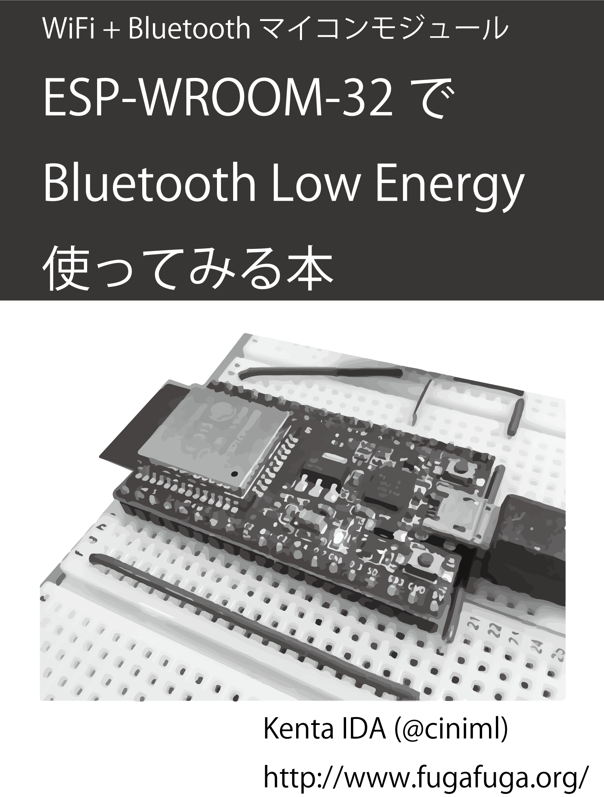
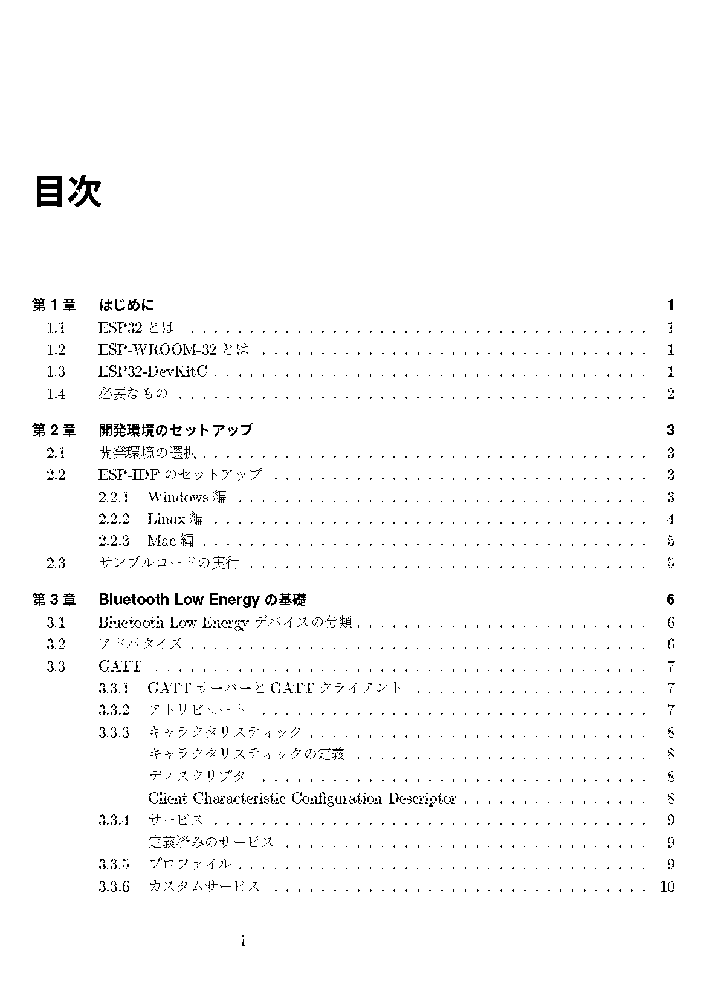
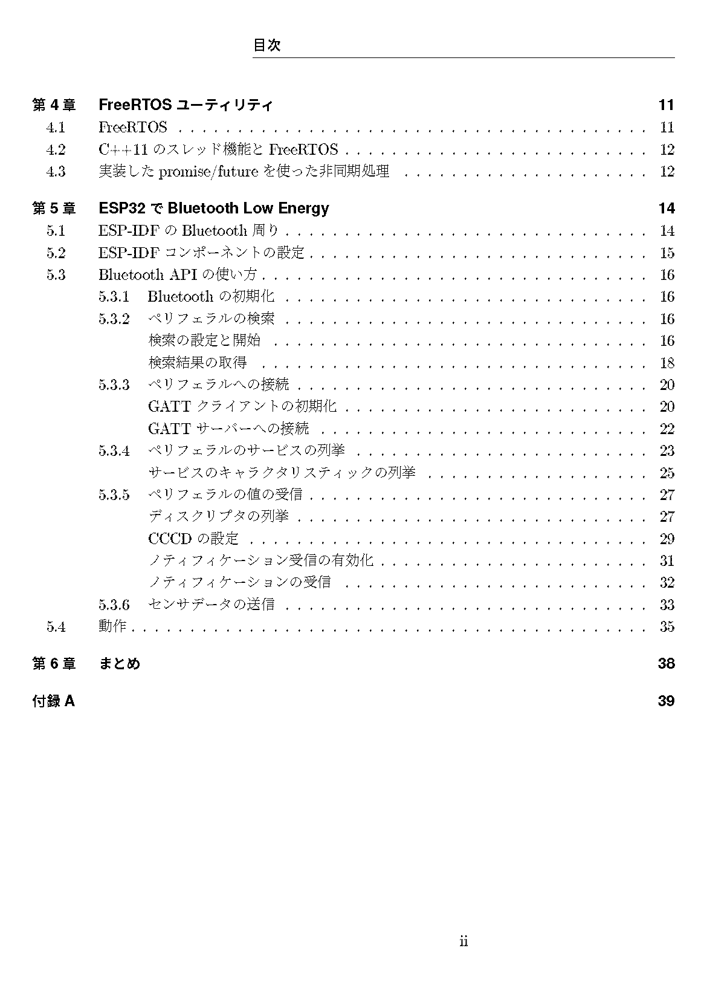

技術書典3出展
===============

概要
------
2017年10月22日に秋葉原のUDXで開催された、技術書典3に出展したのでその経緯と結果について報告する。

頒布物
---------
「ESP-WROOM-32でBluetooth Low Energy使ってみる本」というタイトルで、ESP32のGATTクライアント周りの使い方について書いた物を頒布した。

準備
------------

技術書典、技術書典22を見に行って、出展したらもっと楽しそうと思ったので、とりあえず締め切りぎりぎりに申し込みをした。
一応ESP32で遊び始めていたので、そのあたりのネタでなんかしら書こうと考えていた。

その後、いくつか雑誌の記事の執筆などがあったので、直前まで執筆作業には手が付けられずにいた。
ネタの方は幸い、直前の記事の内容もESP32ネタだったので、その最中で雑誌のネタにならない細かいところの説明をすることにした。
ただし、結局1週間前くらいまでほとんど作業時間が取れず、当日も朝方までサンプルコードと原稿の修正をしていた。

文章から図の清書まで全部自分で用意するのはなかなか大変で、文章のチェックもしてもらえないので、雑誌に書くときに編集者

さすがに印刷をしないと間に合わなさそうになった段階で、レーザープリンタで時間ギリギリまで印刷をしていた。
自炊用に裁断機があったので化粧断ち的なことは簡単にできたのは良かった。

電子版頒布用のカードは、対面伝書というサービスを使った。
印刷するなどして渡したシリアルコードを入力するとデータがダウンロードできるサービスで、シリアルコードの管理機能としてCSVにエクスポートすることができる。

このCSVからIllustratorの変数のデータセットに入力できるXMLを手作業で作成し、シリアルコードを印刷したカードを作った。
変数機能は便利だが、変数に入力するデータセットはXMLで記述しなければならない。
CSVからデータセット変換は割と面倒なので、自動化したいところである。

他には、デモ用の機材として、

    * AE-ESP-WROOM-32
    * ESP32-DevKitC
    * CC2650STK SensorTag

を用意した。

当日
----------

上記の通り持ち物がA5の薄い冊子17部と電子版カード、あとはデモ用の器材だけだったので、30リットルくらいの
バックパック1つで済んだ。
当日はかなり雨が降っていたので結果的に良かった。

会場についたのは10:45くらいで、すでにほとんどの出展者が会場に入って準備を終えていた。

配置された場所は「き07」で、周りでは自作ハードウェアやキットの頒布をしているサークルが配置されているようで、電子工作・ハードウェアブロックのような感じだった。
隣では「`BEEP on USB <http://beep.prioris.jp/>`_」を頒布しており、なんだか懐かしい音が聞こえてきたりしたので、休憩中にフルセットを買った。

開始後1時間くらいで、用意した物理本17部中、見本用に残していた1部を除いて全部売れた。かなり予想外だった。
昼頃までは持ってきたデモ用機材もアクセスポイントの設定の変更を忘れたため動作しておらず、単にブレッドボードにESP32-DevKitCを刺した状態でおいているだけだったにもかかわらず、割と見本誌を見てくださった方には買って言っていただけた。
しまいには、「GATTサーバーではなくGATTクライアントの内容しかないが良いのか」と確認してから売るようになったが、それでも良いという方がほとんどだった。

最終的には、「物理本+ダウンロードカード」16部、「ダウンロードカードのみ」31部の合計47部を頒布した。
当日の朝に見た被チェック数が30くらいだったので半分の15部くらいかなと思っていたが、それよりも多かったので驚いた。
ある購入された方に言われたのが、「ESP-WROOM-32買ったけど積んでいるので気になった。積んでる人なら気になるのではないか」ということだったので、割とESP-WROOM-32を積んでいる方が多かったのかもしれない。

昼過ぎごろには前職の後輩が手伝いにきてくれたので、途中1時間くらい会場を見て回って欲しい本をいくつか購入することができた。
ただ、あとで見返してみるといろいろ買いに行くのを忘れていたようである。

反省点
--------------

頒布物
++++++++

まず何よりも頒布物のクオリティである。

物理的なクオリティとしては、自分で印刷して製本作業を行っており、この手の作業は初めてだったのもあり、どうしても綺麗につくれていない。
やはりきちんと外注して印刷してもらった方が良い。

また、印刷前の原稿のレイアウトにもいくつか問題がある。
直前まで書いていたので、レイアウトを調整する時間がなく、とくにRe:VIEWで弱いとされる表のレイアウトがどうしても調整できなかった。
そのままだと表中の文字が枠を突き抜けて行ってしまうので、しかたなく強制改行したが、そうすると縦方向の位置がずれる。
ここは解決できなかったが、拡張を導入するなどで対処している方もいらっしゃるようなので、今後解決していきたい。

内容に関してもいろいろ不足している点がある。
そもそも、GATTクライアントだけではなくGATTサーバーの実装例も記載するつもりだったが、実験が間に合わずGATTクライアントだけとなってしまった。
そのため、タイトルから想像される、「ESP32でBLEデバイスをつくる(＝GATTサーバーの実装)」という内容がなくなってしまい、誤解しやすい状態になってしまった。
内容が確定した時点でタイトルを変更すべきであった。
このあたりは内容を追加してダウンロード版の方の更新で対応したいと思う。

総じて言えるのは、準備に対する時間不足、スケジューリングの問題があったということである。

次回があるのなら、もっと余裕をもって準備をおこないたい。

ブースの展示
++++++++++++++

ブースの展示に関しては、会場について物を配置し始めてからいろいろ問題点に気づいた。

まず、頒布物の価格を表示するものを用意し忘れた。
これにかんしては、技術書典公式の「例の後払い決済」に登録していたため、運営側から頒布物の価格とQRコードを印刷したものを頂けたので、なんとかなった。
本当に助かりました。

次に、デモの準備である。
一応デモとして、ESP-WROOM-32でCC2650のセンサ・データをBLE経由で受信して、AWS IoT Hubに投げるものを用意した。
ただし、AWS IoT Hubに投げたあとのグラフ表示などの部分を用意できなかったので、AWSコンソールのIoT Hubテスト用画面でJSON形式で届いた温度と湿度データの内容を表示するだけの地味なものだった。
やはりグラフ表示があった方が目を引くし、当日は台風が来ていたので温湿度に加えて気圧センサの内容も表示できると面白かったと思う。

また、ブースでの電源利用申請をしていなかったので、途中でノートPCのバッテリが切れた。

結局のところ準備不足である。

まとめ
----------

今回、初めて出展する側として参加したが、やはり、自分の興味のあることについていろいろな方とお話しできるというのはとても良かった。
いろいろ準備不足ではあったものの、次回があればまた参加したいと思う。

