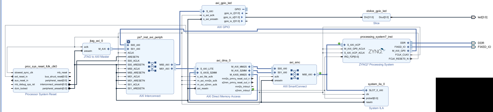
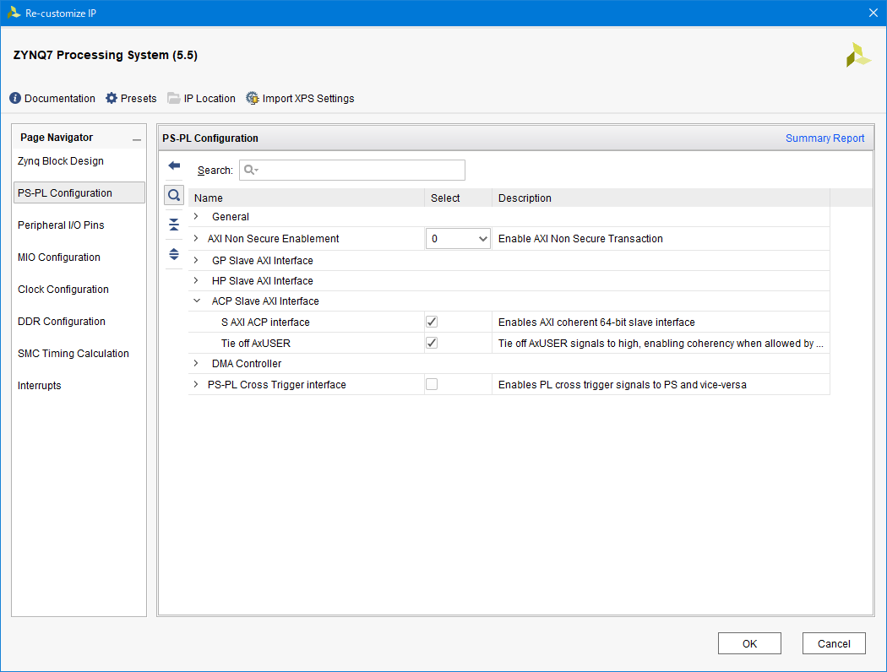
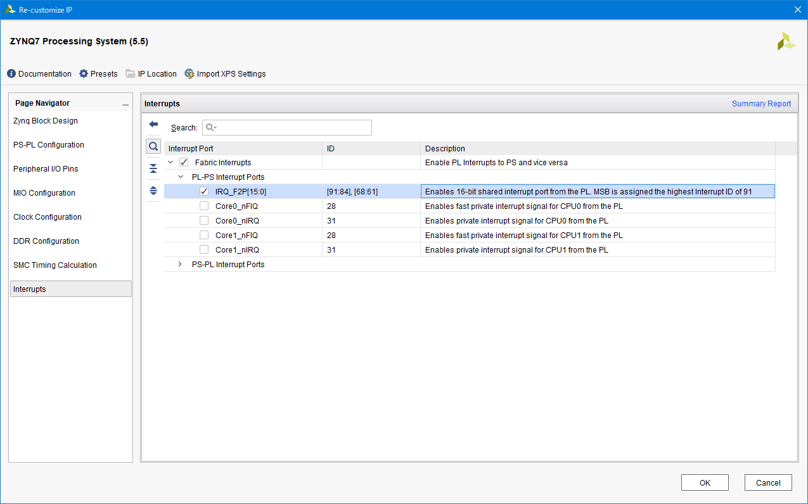
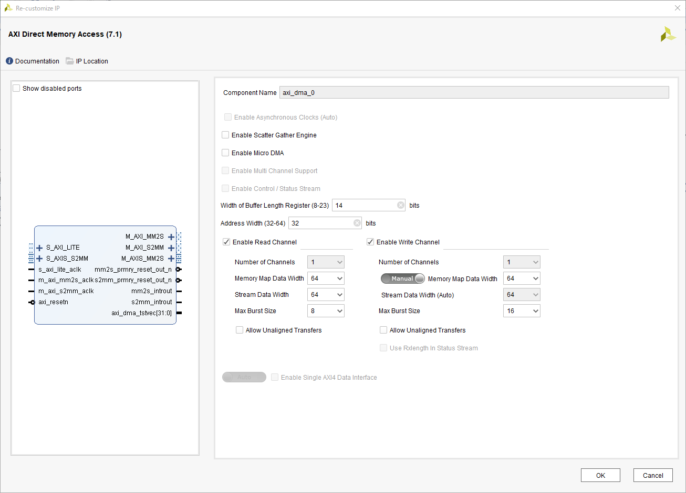
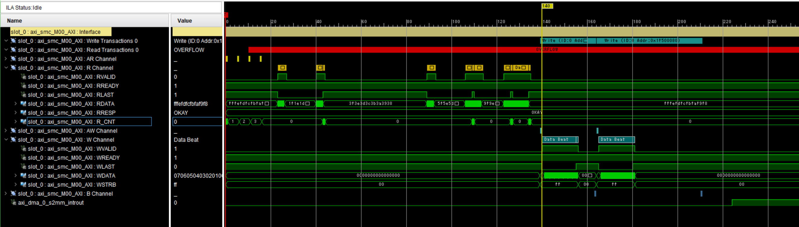
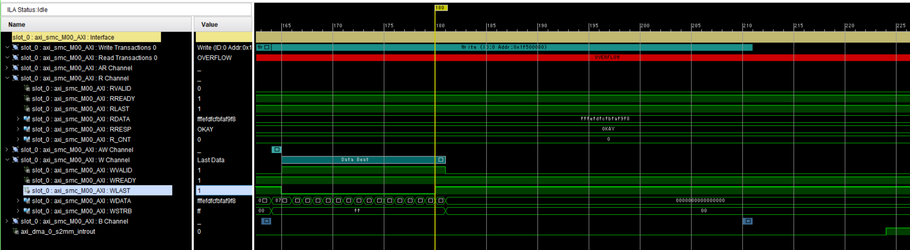
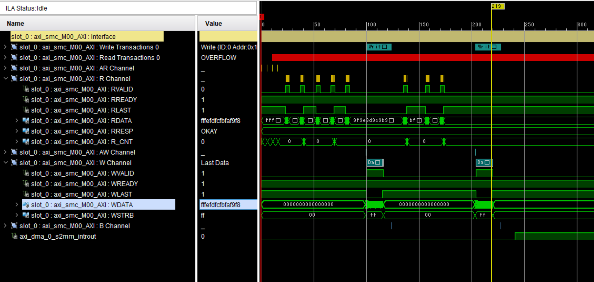

FPGA+SoC+LinuxでXilinx AXI DMAを試す
======================================================================================================

概要
--------
FPGA+SoC+Linux on PYNQ-Z1でDevice Tree Overlayと`udmabuf`を使ってXilinx AXI DMAを試した。

背景
--------
FPGA+SoC+Linux実践勉強会 [1]_ に参加して、Device Tree Overlayとudmabufを使ったDMAを試そうとしたが、時間が足りず`UIO`経由でGPIOを操作してLEDを光らせることしかできなかった。

もともとDevice Tree Overlayと合わせてDMAを簡単に試すことが目的だったので、残りのDMAの部分を試してみた。

.. [1] https://fpgax.connpass.com/event/71364/?utm_campaign=event_message_to_selected_participant&utm_source=notifications&utm_medium=email&utm_content=title_link

実験に用いたデザイン
---------------------

下記のPYNQ-Z1 (XC7Z020-CLG400-1)用デザインを作成した。エクスポートしたものは `ここ <https://gist.github.com/ciniml/8175719409d7f237654427425eaa4a99>`_ にある
また、プロジェクトのアーカイブを `OneDrive <https://1drv.ms/u/s!AvgeuJrD0ORom6YVxgYtwghP90gCbA>`_ に置いておく。

PSのACPポートにAXI DMAを接続し、DMAのM_AXIS_MM2SをS_AXIS_S2MMに繋いで、DMAでPSのメモリから読みだした内容をDMAでPSのメモリに書き込むという構成となっている。
また、DMAの転送完了時の割り込みを受け取るために、AXI DMAのs2mm_intoutをPSのIRQ_F2Pに接続している。

PSのACPポートでは、S AXI ACP Interfaceを有効にしている。また、AXI DMAはDirect Registerモードの場合、AxUSERの値を制御できないので、Tie off AxUSERを有効にしている。

PSの割り込みの設定では、IRQ_F2P[15:0]を有効にしている。これによりコア共有の割り込み(Shared Peripheral Interrupt : SPI)をPLから入力することができる。

AXI DMAは上記の通り、Scatter Gather Engineを無効にし、Memory Map Data WidthやStream Data Widthを64bitに設定する。

DMAで一度に長い転送を行いたい場合は、 `Width of Buffer Length Register` を増やしておく。デフォルトでは14ビットなので、2^14 - (DataWidthBytes) = 16384 - 8 = 16,376バイトまでしか転送できない。
最大で、8[MiB] - 8 バイトまで設定できる。

実験に用いたコード
-------------------

実験には、`FPGA-SoC-Linuxのリポジトリ <https://github.com/ikwzm/FPGA-SoC-Linux/>`_ にある`uio_irq_sample <https://github.com/ikwzm/FPGA-SoC-Linux/tree/master/target/zynq-pynqz1/examples/uio_irq_sample>`_ をAXI DMA用に変更したコードを用いた。

uio_irq_sampleを適当にコピーし、 *sample1.c* と *sample_common.h* を変更した。

元のuio_irq_sampleで使用しているデザイン内のDMAコアと異なり、Xilinx AXI DMAのDirect Registerモードでは、転送バイト数を指定する ``LENGTH`` レジスタに書き込みを行うと転送を開始する。
このため、``pump_setup`` 関数から転送バイト数の引数を除き、``pump_start`` 関数に転送バイト数の引数を追加している。

sample1.cの方は、上記の変更に合わせて、呼び出し時の引数を変更している。

sample_common.hの変更部分の抜粋 ::

    #define  PUMP_OUTLET_DMACR      (0x0030)
    #define  PUMP_OUTLET_DMASR      (0x0034)
    #define  PUMP_OUTLET_DA         (0x0048)
    #define  PUMP_OUTLET_DA_MSB     (0x004c)
    #define  PUMP_OUTLET_LENGTH     (0x0058)

    #define  PUMP_INTAKE_DMACR      (0x0000)
    #define  PUMP_INTAKE_DMASR      (0x0004)
    #define  PUMP_INTAKE_SA         (0x0018)
    #define  PUMP_INTAKE_SA_MSB     (0x001c)
    #define  PUMP_INTAKE_LENGTH     (0x0028)

    #define  PUMP_CR_RS     (1u<<0)
    #define  PUMP_CR_RESET  (1u<<2)
    #define  PUMP_CR_IOC_IrqEn  (1u<<12)
    #define  PUMP_CR_ERR_IrqEn  (1u<<14)

    #define  PUMP_SR_HALTED (1u<<0)
    #define  PUMP_SR_IDLE   (1u<<1)
    #define  PUMP_SR_IOC_Irq    (1u<<12)
    #define  PUMP_SR_ERR_Irq    (1u<<14)
    static inline void pump_intake_reset(void* regs)
    {
        regs_write32(regs + PUMP_INTAKE_DMACR, PUMP_CR_RESET);
        while( regs_read32(regs + PUMP_INTAKE_DMACR) & PUMP_CR_RESET );
    }
    static inline void pump_outlet_reset(void* regs)
    {
        regs_write32(regs + PUMP_OUTLET_DMACR, PUMP_CR_RESET);
        while( regs_read32(regs + PUMP_OUTLET_DMACR) & PUMP_CR_RESET );
    }
    static inline void pump_intake_setup(void* regs, unsigned long buf_addr)
    {
        regs_write32(regs + PUMP_INTAKE_DMACR , PUMP_CR_RS | PUMP_CR_IOC_IrqEn | PUMP_CR_ERR_IrqEn);
        regs_write32(regs + PUMP_INTAKE_DMASR , PUMP_SR_IOC_Irq | PUMP_SR_ERR_Irq);
        regs_write32(regs + PUMP_INTAKE_SA    , buf_addr);
        regs_write32(regs + PUMP_INTAKE_SA_MSB, buf_addr >> 32);
    }

    static inline void pump_outlet_setup(void* regs, unsigned long buf_addr)
    {
        regs_write32(regs + PUMP_OUTLET_DMACR , PUMP_CR_RS | PUMP_CR_IOC_IrqEn | PUMP_CR_ERR_IrqEn);
        regs_write32(regs + PUMP_OUTLET_DMASR , PUMP_SR_IOC_Irq | PUMP_SR_ERR_Irq);
        regs_write32(regs + PUMP_OUTLET_DA    , buf_addr);
        regs_write32(regs + PUMP_OUTLET_DA_MSB, buf_addr >> 32);
    }

    static inline void pump_intake_start(void* regs, unsigned int xfer_size)
    {
        regs_write32(regs + PUMP_INTAKE_LENGTH, xfer_size);
    }

    static inline void pump_outlet_start(void* regs, unsigned int xfer_size)
    {
        regs_write32(regs + PUMP_OUTLET_LENGTH, xfer_size);
    }

    static inline void pump_intake_clear_status(void* regs)
    {
        regs_write32(regs + PUMP_INTAKE_DMASR, PUMP_SR_IOC_Irq | PUMP_SR_ERR_Irq);
    }

    static inline void pump_outlet_clear_status(void* regs)
    {
        regs_write32(regs + PUMP_OUTLET_DMASR, PUMP_SR_IOC_Irq | PUMP_SR_ERR_Irq);
    }

    static inline void pump_reset(void* regs)
    {
        pump_intake_reset(regs);
        pump_outlet_reset(regs);
    }

    static inline void pump_setup(void* regs, unsigned long src_addr, unsigned long dst_addr)
    {
        pump_outlet_setup(regs, dst_addr);
        pump_intake_setup(regs, src_addr);
    }

    static inline void pump_start(void* regs, unsigned int xfer_size)
    {
        pump_outlet_start(regs, xfer_size);
        pump_intake_start(regs, xfer_size);
    }

sample1.cの変更部分の抜粋 ::

    //check_size = outlet_buf.buf_size;
    check_size = 0x100;
        
        printf("Resetting DMA core... \n");
        // Reset DMA core.
        pump_reset(regs);

        while (--check_count >= 0) {
            int error_count = 0;
            int i;

            for(i = 0; i < check_size ; i++) {
                ((unsigned char*)(intake_buf.buf))[i] = (i & 0xFF);
                ((unsigned char*)(outlet_buf.buf))[i] = 0;
            }

            gettimeofday(&start_time, NULL);
            printf("Setting up DMA... \n");
            pump_setup(regs, intake_buf.phys_addr, outlet_buf.phys_addr);
            uio_irq_on(uio_fd);
            printf("Starting DMA... \n");
            pump_start(regs, check_size);

元のコードではcheck_sizeをudmabufで確保したバッファの長さとしているが、前述のAXI DMAの転送可能な長さより大きいので、今回は256バイトに制限している。

あと、細かい点であるが、ビットストリームを更新しても `rake install` で `/lib/firmware` 以下のビットストリームが更新されなかったので、 `Rakefile` に依存関係を指定した。 ::

    file "/lib/firmware/#{FPGA_BITSTREAM_FILE}" => ["#{FPGA_BITSTREAM_FILE}"] do
    sh "cp #{FPGA_BITSTREAM_FILE} /lib/firmware/#{FPGA_BITSTREAM_FILE}"
    end

実行結果
-----------

以下に実行時の出力を示す ::

    fpga@debian-fpga:~/examples/uio_irq_sample_modified$ ./sample1
    Resetting DMA core...
    Setting up DMA...
    Starting DMA...
    time = 0.000134 sec
    check buffer error addr=00000001, i=01, o=00
    check buffer error addr=00000002, i=02, o=00
    check buffer error addr=00000003, i=03, o=00
    check buffer error addr=00000004, i=04, o=00
    check buffer error addr=00000005, i=05, o=00
    check buffer error addr=00000006, i=06, o=00
    check buffer error addr=00000007, i=07, o=00
    check buffer error addr=00000008, i=08, o=00
    check buffer error addr=00000009, i=09, o=00
    check buffer error addr=0000000a, i=0A, o=00
    check buffer error addr=0000000b, i=0B, o=00
    check buffer error addr=0000000c, i=0C, o=00
    check buffer error addr=0000000d, i=0D, o=00
    check buffer error addr=0000000e, i=0E, o=00
    check buffer error addr=0000000f, i=0F, o=00
    check buffer error addr=00000010, i=10, o=00
    check buffer error

なぜか転送結果が一致していないようである。デザイン中のPSのACPポートとインターコネクトの接続部分にILAを入れてあるので波形を観測した結果は次の通りである

一番下の `axi_dma_0_s2mm_introut` が、メモリへのDMA転送完了時の割り込み信号である。ぱっと見た感じでは、書き込みのトランザクション完了後に割り込み信号が起きており、正常に動作しているように見える。

また、最後の書き込みトランザクションの、最後の書き込みデータは 0xfffefdfc_fbfaf9f8 となっており、サンプルプログラムの期待値と一致する。

以上より、データ・キャッシュ周りが怪しいので、udmabufのデバイスを開くときに、O_SYNCを指定してキャッシュを無効化して再度実行した。 ::

    fpga@debian-fpga:~/examples/uio_irq_sample_modified$ ./sample1
    Resetting DMA core...
    Setting up DMA...
    Starting DMA...
    time = 0.000111 sec
    Setting up DMA...
    Starting DMA...
    time = 0.000166 sec

今度は成功したようである。

また、処理中の信号波形は以下のようになった。

転送時の波形の変化と、キャッシュの効果の関係については不明である。

念のため、合成結果でACPポートのAxUSERの接続について確認したが、SAXIACPARUSER、SAXIACPAWUSERともに1に固定となっている。
また、O_SYNCを指定する前のAWCACHEの値も、以下の通り0x03となっている。

.. image:: figure/dma_test_design_ila_awcache.PNG
    :scale: 50

まとめ
-------

udmabufを使ったXilinx AXI DMAのDirect RegisterモードでのDMA転送はかなり簡単にできることが分かった。

ただし、ACPポートを使ったキャッシュ周りの管理は、もう少し調査が必要である。

参考
------

ikwzm/FPGA-SoC-Linux
    https://github.com/ikwzm/FPGA-SoC-Linux/

FPGA+SoC+Linux+Device Tree Overlay+FPGA Manager(PYNQ-Z1対応)
    https://qiita.com/ikwzm/items/d6fdaa859906252fd8b0

Linux Kernel 4.10でのFPGAサポート事情
    https://qiita.com/ikwzm/items/2ff7d5429da8ace7c0bd

Linux の FPGA Manager で Xilinx のビットストリームファイルを扱う方法
    https://qiita.com/ikwzm/items/1bb63be0b86a1e0e56fa
    
    FPGA Managerにビットストリームを渡す場合は、ヘッダを除去してエンディアン変換しないといけないらしい。

Zynq-7000 All Programmable SoC Technical Reference Manual (UG585)
    https://www.xilinx.com/support/documentation/user_guides/ug585-Zynq-7000-TRM.pdf

    pp.103-106にACPポートのAxCACHE、AxUSERの意味の説明が書いてある。
