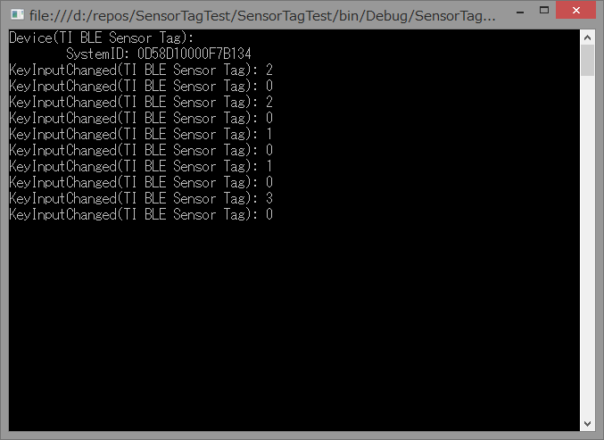

WinRTのGATTクライアントであるサービスを含むデバイスの他のサービスを列挙する方法
===============================================================

概要
------
WinRTでGATTクライアント周りを操作する際に，あるGATTサービスがどのBluetoothデバイスにあるか判別する方法について説明する

GATTサービスの列挙
-----------------
例として，short UUIDが0xfff0であるGATTサービスの列挙は以下のコードで行うことが出来る．コード片では変数の型が分かりづらいので型推論を使用せずに記述している．::

    String filter = GattDeviceService.GetDeviceSelectorFromShortId(0xfff0);
    DeviceInformationCollection devices = await DeviceInformation.FindAllAsync(filter).AsTask();

WinRTでは各GATTサービスが一つのサービスデバイスとして扱われ，上記コードではdevicesに0xfff0のshort UUIDを持つサービスデバイスのデバイス情報のコレクションが格納される．

実際にサービスにアクセスするためには，上記のDeviceInformationCollection中のDeviceInformationを用いて::
    
    DeviceInformation device = device.First(); // とりあえず先頭
    GattDeviceService service = await GattDeviceService.FromIdAsync(device);

としてGattDeviceServiceを取得する．このGattDeviceServiceは，あるBluetoothデバイス　[#]_ 中の１つのGATTサービスに対応している．

.. note::
    .. [#] 実際の物理的なデバイスとサービスごとのデバイスがややこしいので，前者をBluetoothデバイス，後者をサービスデバイスと呼ぶことにする．

問題点
-------
前述のサービス列挙の流れから分かるように，ある1つのBluetoothデバイス中のサービスを列挙するという流れになっておらず，
あくまでシステムが認識している全てのGattDeviceServiceの中から指定したサービスUUIDを持つサービスデバイスを検索するようになっている．
よって，この方法ではある1つのデバイス中の複数のサービスを関連づけることができない．

これでは，例えば，ある温度センサデバイスが残りの電池容量を通知するために温度データサービスに加えてBatteryInformationServiceにより残電池容量を公開しており，センサデータとともに電池容量を表示したいとしても
どの温度データサービスがどのBatteryInformationServiceに結びつくのかわからない．

上記問題を解決するためには，各GattDeviceServiceがどのBluetoothデバイスに属するのかを取得する必要がある．

解決方法
--------
各GattDeviceServiceを取得するのに用いたDeviceInformationクラスには，Propertiesと言う名前の読み取り専用のIReadOnlyDictionary<String,Object>型のプロパティがある．
このプロパティにはデバイスに関する様々な情報が格納されているが，標準では必要な情報が格納されていない．

一方，DeviceInformation.FindAllAsyncメソッドには，前述のfilter文字列(AQS文字列というらしい)1つを指定する他に，FindAllAsync(String aqsFilter, IEnumerable<String> additionalProperties)という形式の
オーバーロードがある．
引数の名前からわかるように，第2引数に追加で取得したいプロパティ名を指定することにより，Propertiesプロパティに値が格納される．

この機能を用いて，あるデバイスが属するデバイスIDを表すプロパティである `System.Devices.ContainerId` プロパティを取得する．
サービスデバイスの場合，これはサービスデバイスが表すサービスが属するBluetoothデバイスとなるので，この `System.Devices.ContainerId` プロパティが一致するサービスデバイスは同一のBluetoothデバイスに属することとなる．

また，DeviceInformation.FindAllAsyncメソッドの第1引数は，AQSというクエリ文字列となっている．
実際に，GattDeviceService.GetDeviceSelectorFromId/GetDeviceSelectorShortFromId()メソッドは指定したサービスUUIDを持つサービスデバイスを検索するための以下のようなクエリ文字列となっている．::

    System.Devices.InterfaceClassGuid:="{6E3BB679-4372-40C8-9EAA-4509DF260CD8}" AND System.DeviceInterface.Bluetooth.ServiceGuid:="{00001800-0000-1000-8000-00805F9B34FB}" AND System.Devices.InterfaceEnabled:=System.StructuredQueryType.Boolean#True

ここから分かるように，"プロパティ名:=条件"という形式の文字列をANDでつなげればプロパティに関する条件を指定できることが分かる．
よって，前述のSystem.Devices.ContainerIdプロパティが一致する条件式を追加すればDeviceInformation.FindAllAsyncメソッドで特定のBluetoothデバイスに属するサービスデバイスを取得することができる．

以上より，指定したサービスデバイスと同一のBluetoothデバイスに属する他のサービスを取得するGetOtherServiceAsyncは以下のコードで実装できる::

    private const string ContainerIdProperty = "System.Devices.ContainerId";
    static async Task<GattDeviceService> GetOtherServiceAsync(DeviceInformation serviceInformation, Guid serviceUuid, CancellationToken cancellationToken)
    {
        var containerId = serviceInformation.Properties[ContainerIdProperty].ToString();
        var selector = GattDeviceService.GetDeviceSelectorFromUuid(serviceUuid);
        var selectorWithContainer = String.Format("{0} AND System.Devices.ContainerId:=\"{{{1}}}\"", selector, containerId);
        var serviceInformations = await DeviceInformation.FindAllAsync(selectorWithContainer, new[] { ContainerIdProperty }).AsTask(cancellationToken);
        return await GattDeviceService.FromIdAsync(serviceInformations.Single().Id);
    }

使用する前提条件として，serviceInformation引数に渡すサービス情報は，DeviceInformation.FindAllAsync(filter, new[] { ContainerIdProperty })として，System.Devices.ContainerIdプロパティを取得しておく必要がある．

サンプルコード
-----------
例として，Texas InstrumentsのCC2541 SensorTag開発キットのスイッチ入力とDeviceInformationServiceによるデバイス情報を結びつけて表示するコンソールアプリケーションを作成した．
以下にその画面を示す．

1行目のDevice(TI BLE Sensor Tag)の"TI BLE Sensor Tag"の部分は，GenericAttributeProfileのDevice Name Characteristicから取得している．
また，2行目のSystemID(...)の内容は，DeviceInformationServiceのSystem ID Characteristicから取得している．
3行目以降のKeyInputChangedはキー入力情報のCharacteristicから取得している．

このプログラム実行時には，CC2541 SensorTag開発キット以外に，LBT-VRU01というLogitec製のBLEデバイスもPCに接続している．
そのため，今回説明したGattOtherServiceAsyncを用いなければ，Generic Access Profile(GAP)経由で取得するデバイス名にCC2540 SensorTag開発キットのデバイス名ではなくLBT-VRU01のデバイス名が表示される可能性があるが，
上記の結果より正しく同一デバイス上のサービスを結びつけられていることがわかる．

サンプルコードのソースコードはgithub上にアップロードしてある．
https://github.com/ciniml/SensorTagTest/tree/master/SensorTagTest

上記リポジトリのmasterブランチにはGattOtherServiceAsyncを用いてGAPサービスを取得するコードが，wo_otherserviceasyncブランチにはGattOtherServiceAsyncを使わないコードが含まれている．

参考
-----

* `関連する PnP オブジェクトの取得 <http://msdn.microsoft.com/ja-jp/library/windows/apps/hh825872.aspx>`_
* http://www.hanselman.com/blog/HowToCallWinRTAPIsInWindows8FromCDesktopApplicationsWinRTDiagram.aspx>
* `SensorTag User Guide - Texas Intruments Wiki <http://processors.wiki.ti.com/index.php/SensorTag_User_Guide#Contactless_IR_Temperature_Sensor>`_
