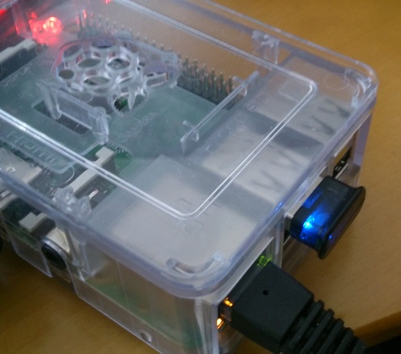
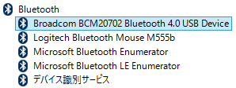
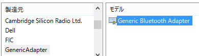
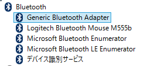
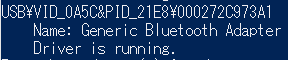

Windows 10 IoT Core Preview版でBLEのAdvertisementを受信する
===============================================================

概要
------
Windows 10 IoT CoreのPreview版が公開されたので、Bluetooth4.0のUSBドングルを接続したRaspberryPi2に入れてAdvertisementパケットを受信してみた。

動機
------
RaspberryPi2(以降RPi2)が発表されたと同時に予約して買ったはいいものの、お約束通りMonoが動いたのを確認して以降積んでいた。
そこに先日のBuild2015にてWindows 10 IoT Coreが発表されたので、早速DLしてセットアップしてみたところ、とりあえず起動までは簡単にできた。
Visual Studio 2015からサンプルアプリのビルド、配置、デバッグが簡単にできることも確認した。

元々、BLEデバイスにつながる && ネットワークにつながる && C#で楽ちん開発ができる環境が欲しかったので、あとはBLEデバイスにさえつながれば完璧である。
そこで、以前Windows8.1のPCで動作を確認したBluetooth4.0対応のUSB Bluetooth アダプタを接続したが、どうもBluetoothアダプタを認識しないようなので、あれこれ試したみた。

作ったもの
---------
ソースコードは `GitHubのリポジトリ <https://github.com/ciniml/Win10IoTBLEScanner>`_ にて公開している。

* 受信したAdvertisementの送信元BLEデバイスの名前とアドレス、RSSI値を表示するアプリケーション
    - Windows 10 IoT CoreもしくはWindows10TP上で動作する。
* Windows 10 IoT Coreで特定のVID/PIDを持つデバイス用に標準BluetoothドライバをインストールするためのINFファイル生成ツール
    - Windows 10 IoT Coreのシステム上にある *BTH_MC.inf* に後述の手順の加工を施したものを生成する

Bluetoothアダプタを認識させる
--------------------------
以前Windows8.1で動作確認したアダプタは、BroadcommのBCM20702というチップが使われているものだった。
このアダプタは、Windows8.1のPCに接続した場合、 "Broadcomm BCM20702 Bluetooth4.0 USB Device"として認識され、Broadcomm製のドライバがロードされる。
そのため、Windows 10 IoT　Core on RPi2に接続しただけでは、ドライバが見つからず動作しなかった。

一方、Bluetoothの規格では、ホストとBluetoothコントローラとの通信はHCIとして定義されているので、基本的にはHCIに従ったドライバがあれば動作するはずである。
Windows10にも、HCIに従ったBluetoothコントローラ用のドライバが標準で入っている。

そこで、デスクトップPCでデバイスマネージャ上で標準ドライバ(Generic Bluetooth Adapter)に入れ替えてみたところ、Bluetoothマウスが動作することを確認できた。

Windows 10 IoT Core on RPi2 の C:\Windows\Inf ディレクトリ内を調べたところ、BTH_MC.inf というファイルにGeneric Bluetooth Adapterの定義があることがわかったので、
Windows 10 IoT Coreでも標準ドライバに入れ替えられればBluetoothアダプタを動作させられそうである。

ドライバの入れ替え
--------------------
Windows 10 IoT Coreでにはデバイスマネージャが付属していない代わりに devcon.exe というコマンドラインツールが付属している。このコマンドを用いてデバイスドライバの変更を行う。
まず、現在のデバイスの状況を *status*　コマンドで確認する。::

    > devcon.exe status USB\*
    ...
    USB\VID_0A5C&PID_21E8\000272C973A1
        Name: BCM20702
        The device has the following problem: 28

devconの出力より、BCM20702は"28"というエラーコードのエラーが発生していることがわかる。この"28"はドライバが見つからないというエラーである。
試しに BTH_MC.infを使用するように *updateni*　コマンドでドライバの更新をしてみる。::

    > cd C:\Windows\Inf
    > devcon.exe updateni BTH_MC.inf 'USB\VID_0A5c&PID_21E8\000272C973A1'
    Updating drivers for USB\VID_0A5c&PID_21E8\000272C973A1 from C:\Windows\Inf\BTH_MC.inf.

とりあえずどうなったか確認したところ、::

    > devcon.exe status USB\*
    ...
    USB\VID_0A5C&PID_21E8\000272C973A1
        Name: BCM20702
        The device has the following problem: 28

何も変化していないようである。devcon.exeのエラーの詳細は画面に表示されないようなので、何かログなどは出ないのかとググった [#drvinst]_ ところ、 *setupapi.dev.log* というファイルが出力されるようである。
中身は以下の通りであり特にエラーとみられるメッセージは出力されていない。::
    
    >>>  [Import Driver Package - C:\windows\inf\BTH_MC.inf]
    >>>  Section start 2015/05/06 05:12:14.551
          cmd: "C:\windows\system32\DEVCON.EXE" updateni BTH_MC.inf USB\VID_0A5C&PID_21E8\000272C973A1
         sto: Driver Package = C:\windows\inf\BTH_MC.inf
         sto: Flags          = 0x00000000
         inf: Provider       = Microsoft
         inf: Class GUID     = {e0cbf06c-cd8b-4647-bb8a-263b43f0f974}
         inf: Driver Version = 06/21/2006,10.0.10069.0
         inf: Version Flags  = 0x00000001
         sto: Driver package already imported as 'bth_mc.inf'.
         sto: Driver Store Filename = C:\windows\System32\DriverStore\FileRepository\bth_mc.inf_arm_560dd80861e324ea\bth_mc.inf
    <<<  Section end 2015/05/06 05:12:14.680
    <<<  [Exit status: SUCCESS]

他に何か情報はないのかとdevcon.exeのコマンドをいろいろ試したところ、 *hwids* コマンドでBCM20702のクラスコードが(0xff,0x01,0x01)となっていることがわかった。::

    > devcon hwids USB\*
    ...
    USB\VID_0A5C&PID_21E8\000272C973A1
        Name: Generic Bluetooth Adapter
        Hardware IDs:
            USB\VID_0A5C&PID_21E8&REV_0112
            USB\VID_0A5C&PID_21E8
        Compatible IDs:
            USB\DevClass_FF&SubClass_01&Prot_01
            USB\DevClass_FF&SubClass_01
            USB\DevClass_FF

通常、Bluetoothアダプタのクラスコードは (0xE0, 0x01, 0x01)　となっているはずである。
さらに調べたところ、BCM20702は新しいファームウェアをRAMにダウンロードする機能があるため [#bcm_patchram]_ 、標準ではないクラスコードとなっているようである。
とりあえずファームウェアをダウンロードしなくてもROM上のファームウェアが使われるだけのようなので、どうにかして標準ドライバを使用することを考える。

ドライバがどのデバイスに対応しているのかは、INFファイル内に記載されている対応デバイスのIDやクラスコードで判定されている。たとえば、 
BTH_MC.inf では以下のよに記述されている。

    Generic Bluetooth Adapter=                       Bthusb, USB\Class_E0&SubClass_01&Prot_01
    Generic Bluetooth Adapter=                       Bthusb, USB\MS_COMP_BLUTUTH
    Generic Bluetooth Adapter=                       BthUsb, USB\Vid_0B05&Pid_1712

Bluetoothアダプタのクラスコード (0xE0, 0x01, 0x01) を持つデバイスや、一部のMicrosoft製デバイスが対応するようになっている。
よって、この部分にBCM20702のデバイスIDを追加すればdevconによりインストールできそうである。

オリジナルのBTH_MC.infを変更するのはアレなので、BTH_BROADCOMM.infという名前でコピーして対応デバイスの記述を以下の通り置き換えた。::

    Generic Bluetooth Adapter=                       BthUsb, USB\VID_0A5C&PID_21E8

BCM20702に対してこのinfファイルのドライバパッケージが対応するように指定しdevcon.exeを実行したところ、以下のエラーが発生した。::

    >>>  [Import Driver Package - C:\windows\inf\BTH_BROADCOMM.inf]
    >>>  Section start 2015/05/06 05:31:17.934
          cmd: "C:\windows\system32\DEVCON.EXE" updateni BTH_BROADCOMM.inf USB\VID_0A5C&PID_21E8\000272C973A1
         sto: Driver Package = C:\windows\inf\BTH_BROADCOMM.inf
    ・・・
         flq: Copying 'C:\windows\inf\BTH_BROADCOMM.inf' to 'C:\Users\Administrator\AppData\Local\Temp\{3802b68f-bbd7-584c-b900-470bfb4b484f}\BTH_BROADCOMM.inf'.
    !!!  flq: Error installing file (0x00000002)
    !!!  flq: Error 2: The system cannot find the file specified.
    !    flq:      SourceFile   - 'C:\windows\inf\BTHUSB.SYS'
    !    flq:      TargetFile   - 'C:\Users\Administrator\AppData\Local\Temp\{3802b68f-bbd7-584c-b900-470bfb4b484f}\BTHUSB.SYS'
    !!!  cpy: Failed to copy file 'C:\windows\inf\BTHUSB.SYS' to 'C:\Users\Administrator\AppData\Local\Temp\{3802b68f-bbd7-584c-b900-470bfb4b484f}\BTHUSB.SYS'. Error = 0x00000002
    !!!  flq: SPFQNOTIFY_COPYERROR: returned SPFQOPERATION_ABORT.
    !!!  flq: Error 995: The I/O operation has been aborted because of either a thread exit or an application request.
    !!!  flq: FileQueueCommit aborting!
    !!!  flq: Error 995: The I/O operation has been aborted because of either a thread exit or an application request.
    !!!  sto: Failed to copy driver package to 'C:\Users\Administrator\AppData\Local\Temp\{3802b68f-bbd7-584c-b900-470bfb4b484f}'. Error = 0x00000002
    <<<  Section end 2015/05/06 05:31:18.216
    <<<  [Exit status: FAILURE(0x00000002)]

上記のメッセージより、ドライバ本体のファイルである BTHUSB.SYS が見つからないためエラーになっていることがわかる。
ドライバ本体のファイルは元々インストールされているはずなので、INFファイル内のファイルコピーを行う部分をすべて削除して再度実行したところ、標準ドライバへの置き換えに成功した。

Bluetoothデバイスのペアリング
-------------------------

Windows 10 IoT CoreではBluetoothデバイスのペアリング画面が実装されておらず、デバイスとの接続が行えない。また、ペアリングを行うためのAPIも現時点では用意されていない [#winble_pairing]_ ということなので、BLEデバイスとの接続は試すことができなかった。
BLEデバイスの場合、デバイスへの接続に認証を必要としない使い方もできるため、OSによるペアリング操作を必須とすると利用方法が限られてしまう。将来的にOSによるペアリング操作なしで接続できるようになることを期待したい。

ここで一旦Windows 10 IoT CoreでのBLEデバイスとの通信をあきらめようと思ったが、Windows10で新たにAdvertisementをスキャンするためのAPIが追加されていることが分かったので、Advertisementのスキャンを試してみた。

BluetoothLEAdvertisementWatcher
----------------------------------

Advertisementのスキャンには、 *BluetoothLEAdvertisementWatcher* [#winble_watcher]_ もしくは *BluetoothLEAdvertisementWatcherTrigger* [#winble_trigger]_　を用いる。

前者はフィルタ条件に合致したAdvertisementを受信した場合にReceivedイベントを受け取ることができる。後者はフィルタ条件に合致した際にバックグラウンド処理を開始させることができる。
今回は単純にアプリケーション起動中に受信したAdvertisementを受信するだけなので、 BluetoothLEAdvertisementWatcher を用いる。

Advertisementを受信すると、BluetoothLEAdvertisementWatcherのReceivedイベントが発生し、引数として *BluetoothLEAdvertisementReceivedEventArgs* 型のオブジェクトを受け取ることができる。
BluetoothLEAdvertisementReceivedEventArgsには、受信したAdvertisementに含まれるデータを表すBluetoothLEAdvertisementのほかに、Advertisementを送信したBLEデバイスのアドレスと信号強度を表すRSSI値が含まれている。

.. rubric:: 脚注
    
.. [#drvinst] `ドライバ インストール時のトラブルシューティングの第一歩 <http://blogs.msdn.com/b/jpwdkblog/archive/2009/07/06/9819612.aspx>`_
.. [#bcm_patchram] `[PATCH] Bluetooth: btusb: Add BCM20702 firmware upgrade support <http://comments.gmane.org/gmane.linux.bluez.kernel/47197>`_
.. [#winble_pairing] `Windows 8, Bluetooth LE and BluetoothFindFirstDevice/BluetoothFindNextDevice/BluetoothFindDeviceClose <https://social.msdn.microsoft.com/Forums/windowsdesktop/en-US/3b62bdbf-9a55-4c0f-becf-f4e91d4bc027/windows-8-bluetooth-le-and?forum=wdk>`_
.. [#winble_watcher] `BluetoothLEAdvertisementWatcher <https://msdn.microsoft.com/en-us/library/windows.devices.bluetooth.advertisement.bluetoothleadvertisementwatcher.aspx>`_
.. [#winble_trigger] `BluetoothLEAdvertisementWatcherTrigger <https://msdn.microsoft.com/en-us/library/windows.applicationmodel.background.bluetoothleadvertisementwatchertrigger.aspx>`_
