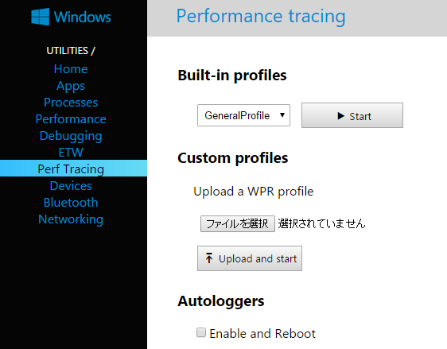
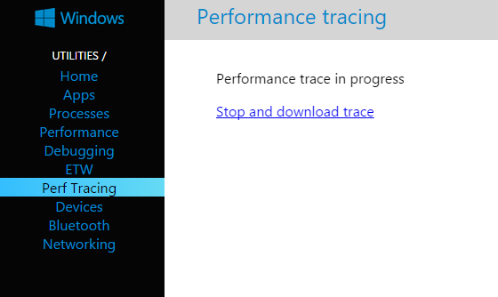
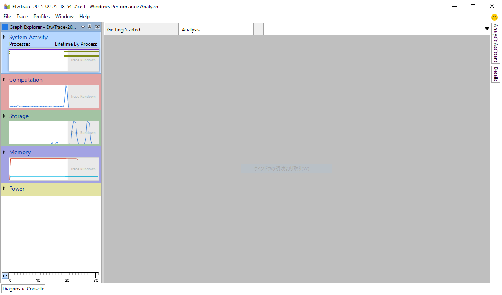
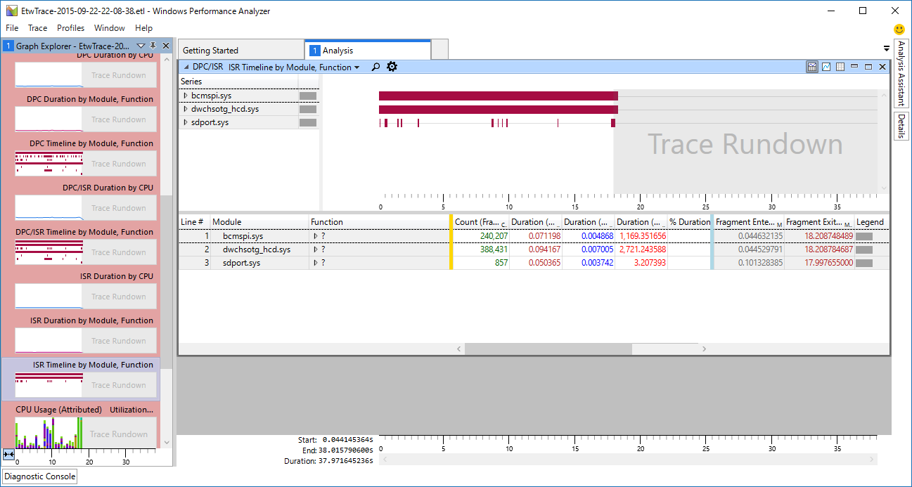
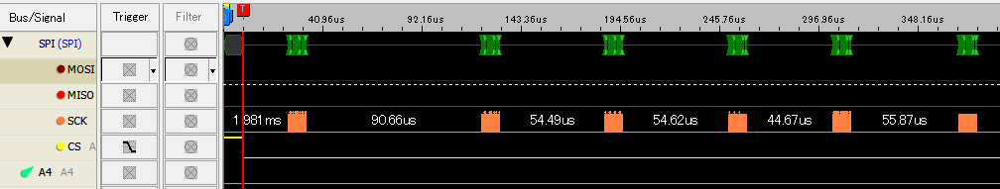
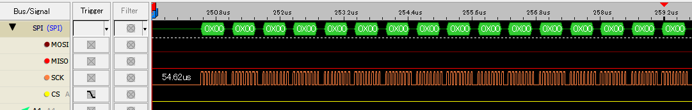

Windows10 IoT Core on RPi2のSPIのパフォーマンス
===============================================================

概要
------
Windows 10 IoT CoreのSPI経由でセンサデータを取得する際にどれくらいのデータが転送できるかを確認するため、SPIのスループットを計測してみた。

作ったもの
------------
計測用のUWPアプリのソースコードは `GitHubのリポジトリ <https://github.com/ciniml/IoTCoreIoTest/>`_ にて公開している。

計測内容
--------
Interface誌の10月号の特集にて、30[MHz]のSPIの信号をRPi2から出力して波形を測定していたので、同様にWindows 10 IoT CoreをSPIマスタとして信号を出力して測定してみた。

SpiDeviceクラスの出力用メソッドには以下の3種類があるため、それぞれでどう変化するかを測定した。

* Write
* TransferFullDuplex
* TransferSequential

結果
-----

===================== ========================
Method                 TransferRate[Bytes/s]
===================== ========================
Write                   429307
TransferFullDuplex      367849
TransferSequential      197820
===================== ========================

とても遅い。
30[MHz]なのでせめて20[Mbps]程度は出てほしいものであるが、一番速い Writeメソッドでも 3[Mbps]程度しか出ていない。

さすがにもう少しスループットが出るものだと思っていたので、なぜ遅いのか原因を調べてみることにした。

割り込み頻度の測定
-------------------

スループットが出ていない原因として考えられるのが、SPIペリフェラルのドライバ(bcmspi.sys)がDMAを使用せず、PIO転送を行っている可能性である。
このような場合、SPIの転送完了割り込みで次のデータを設定している可能性が高いので、割り込みタイミングを確認することにした。

幸い、Windows 10 IoT Coreでは非常に簡単にETW [#etw]_ によるパフォーマンストレースが取得できるので、パフォーマンストレースを取得して解析することにする。

とりあえず収集したログを解析するために、後ほど Windows Performance Analyzer (WPA) を使用するので、 `Windows Assessment and Deployment Toolkit <https://msdn.microsoft.com/ja-jp/library/dn927310(v=vs.85).aspx>`_ 
(ADK [#adk]_) をダウンロードしてインストールしておく。

まず、ブラウザから `<RPi2のIPアドレス>:8080` にアクセスしてWebBを表示する。その後、左のメニューから `Perf Tracing` を選択する。
`Perf Tracing`を選択すると下の画面が表示されるので、 `Start` ボタンを押す。

ボタンを押すと画面がトレース取得中に変化するので、測定したい動作を行う。なるべく早めに測定したい動作を行わないと、トレースファイルがかなり大きくなり後でダウンロードしたいときに時間がかかるので注意。

測定したい動作(今回はSPIの通信処理)を行った後、 `Stop and download trace` リンクを押すとトレース結果のダウンロード準備ののちダウンロードが始まる。
ダウンロード準備の時間は数分のトレースの場合同じく数分かかるのでダウンロードが始まるまで気長に待つこと。

ダウンロードしたトレースデータは `*.etl` という拡張子のファイルになっていて、ADKがインストールされていればWindows Performance Analyzerで開くことができる。

Windows 10 IoT CoreのPerf Tracingで標準設定で取得されるトレースデータには様々なデータが含まれており、WPAの画面左側に様々な項目が表示される。
これらの項目のうち、今回は割り込みの状態を見たいので、 `Computation - DPC/ISR` の順に項目を展開し、 `ISR Timeline by Module, Function` をダブルクリックして内容を表示する。

パッと見て、`bcmspi.sys` の項目に長い帯が表示されているので、頻繁にISR(Interrupt Service Routine:割り込みハンドラ)が実行されているのがわかる。
さらに拡大してみると、割り込みハンドラが数十us間隔で実行されているのがわかる。

.. image:: ./IoTCore_PerformanceTracing_WPA_ISR_Zoom.png

DMA転送をしているのなら、DMA転送完了時の割り込みやDMAの転送が半分終わったときの割り込みとなるはずなので、PIO転送である可能性が高くなった。

SPI信号の観測
-----------------

SPIの信号が転送中にどのようになっているかをロジックアナライザで観測した。

転送開始から数十us間隔で数ワードの転送を繰り返している様子がわかる。
さらに、このうちの1つのブロックを拡大してみる。

一つのブロックに16バイト含まれていることがわかる。ここで、なぜ16バイトごとなのかという疑問がわいてくる。おそらくRPi2に使われているBCM2836の内蔵SPIモジュールの仕様に関する値だろうと思ったので、
BCM2836の資料を確認しようとしたがBCM2836の資料は公開されていないので、代わりにBCM2835の資料 [#bcm2835]_ [#bcm2836]_ を確認することにした。

この資料のp.152にある Figure.10-6 Serial interface Block Diagram によると、16ワード分のFIFOを送信、受信で個別に持っているようである。
また、p.154のCSレジスタのINTDビットの説明によると、DONEビット(送信FIFOが空になったら1になるビット)が1になると割り込みを発生させられるとある。
よって、現行のbcmspi.sysの実装は、この割り込みを使ってFIFOが空になるたびに16バイト分のデータを詰めることを繰り返していると思われる。
この割り込みを使ってから割り込みを処理するまでに遅延があるため転送効率が低く、16バイト転送ごとに数十usの間隔があいてしまっているということである。

Linuxでの実装
----------------
LinuxのBCM2835用SPIドライバの実装 [#linux_bcm_spi]_ を見ると、どうもRXRという割り込みで送信バッファにもデータを詰めているようである。
このRXRという割り込みは受信バッファが一杯になりそうなときに発生する割り込みのようである。
よって、この割り込み発生時には送信バッファが空になりそうということも意味するので、この割り込み発生時に送信バッファにデータを詰めれば途切れなく送信できるはずである。

ただし、こちらの実装でも割り込み応答時間によってはFIFOが空になる可能性があるので、あまり高いスループットは期待できない。
また、DMAを使っていないので、高スループット時にはCPU使用率が高くなる可能性がある。

結論
------
現状のWindows 10 IoT Coreでは、1[Mbps]未満の低速なSPI通信であれば十分に扱えるが、それ以上の通信レートは期待できない。今後の更新によってSPIドライバがDMAに対応することを期待したい。

.. rubric:: 脚注
    
.. [#etw] `第1回　OS機能によるアプリのパフォーマンス測定 <http://www.atmarkit.co.jp/fdotnet/chushin/vsperf_01/vsperf_01_02.html>`_
.. [#adk] Androidのアクセサリを作るアレではない。
.. [#bcm2835] `Broadcom BCM2835 ARM Peripherals <https://www.raspberrypi.org/wp-content/uploads/2012/02/BCM2835-ARM-Peripherals.pdf>`_
.. [#bcm2836] BCM2836はBCM2835のCPU部分をARM11からCortex-A7に変えたような感じで周辺回路はあまり変わっていないらしい。
.. [#linux_bcm_spi] `git.kernel.org spi-bcm2835.c <https://git.kernel.org/cgit/linux/kernel/git/stable/linux-stable.git/tree/drivers/spi/spi-bcm2835.c?id=refs/tags/v3.18.21#n123>`_
