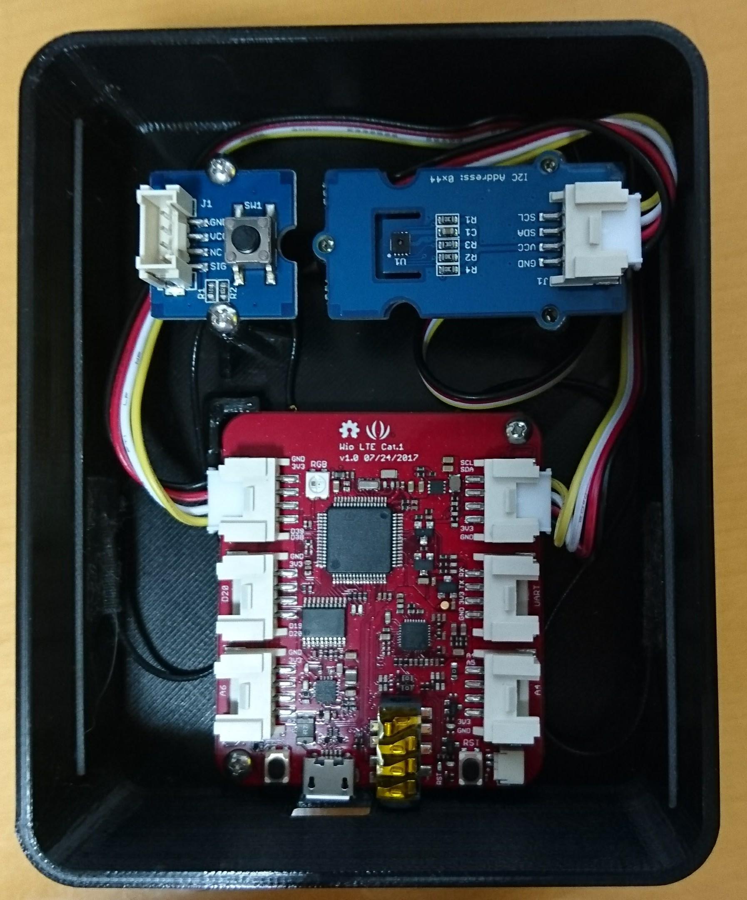
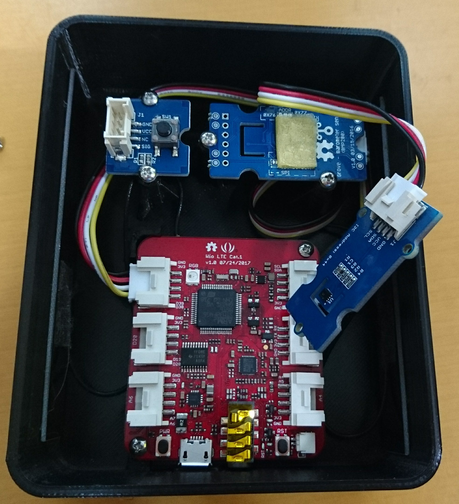
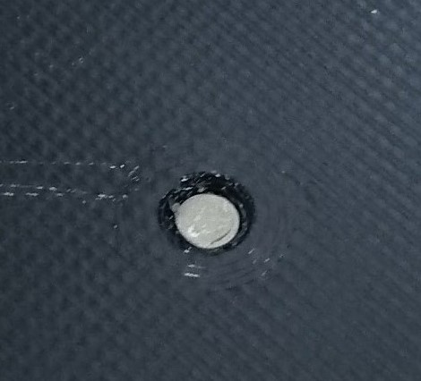

SORACOM Technology Camp 2018 参加レポート
===========================================

概要
------

2018年4月26日に大崎ブライトコアホールで開催された　`SORACOM Technology Camp 2018 <https://technology-camp2018.soracom.jp/>`_ に参加したので、感想などをここに書く。

受付
-----

会場には12:40ごろに着いた。とりあえず受付を済ませたあと、受付周辺に展示されていた、SORACOMを使ったデモの説明を聞いていた。

その中で気になったのが、Wio LTE専用ケースの **PUSH for Wio** だった。

.. image:: PUSH_for_Wio.jpg
    :scale: 25

PUSH for WioはLTEモジュール付きマイコンボード Wio LTE 専用のプラスチック・ケースで、通常であればDMM Makeから3Dプリンタの出力を依頼して入手することができる。(`リンク <https://make.dmm.com/item/904124/>`_)
この PUSH for Wio が会場限定で3,000円で購入できるとのことだった。(通常は6,000くらいかかる)　
Wio LTE用のケースを自分で設計して3Dプリンタで出力しようと思っていたところだったので、一旦はスルーしたものの、会場に荷物を置いてから購入しに受付に戻った。

Wio LTEを使っている人の共通の課題として、ケースをどうするかということがあるようで、最終的に会場での限定数10個はすべて売れたとのことである。

セッション1
-------------

初めの枠はトラックA **ここで一句: SORACOMの全サービスのご紹介** を聴講した。

このセッションでは、タイトルの通り、SORACOMの全サービスの網羅的な説明を聞くことができた。
私自身が使ったことがあるサービスは、SORACOM Air (SIM)、SORACOM Beam、SORACOM Harvestだけだったので、そのほかのサービスの概要について聞けたのは良かった。

その中で、**SORACOM Inventory** というサービスが気になった。
SORACOM Inventoryはデバイスの管理を行うためのサービスで、SORACOM Airでつながっているデバイスの監視ができる。
デバイスの監視をするには、デバイス側が OMA LwM2Mという、デバイス管理用のプロトコルを実装していれば良いようである。
ただし、このLwM2MはUDP用のTLSであるDTLS上のプロトコルであるため、デバイス側でもDTLSを実装しなければならない。

プロトコル変換によりデバイス側でのTLSの処理を不要にできるSORACOM Beamがあるので、SORACOM Inventoryも将来的にデバイス側のDTLS処理が不要となると良いと感じた。

SORACOM Inventory自体はついこの間まではLimited Preview (クローズドβ)だったのが、Public Betaとなり、一般ユーザも使用可能になったので、そのうち試してみたいと思う。

セッション2
-----------------

2番目の枠はトラックB **通信モジュール内蔵デバイス制作のための心構え** を聴講した。

ここでは、SORACOMがリファレンス・デバイスとしてWio LTEやLoRaWANシールド、Sigfoxのドライコンタクトコンバーターを販売している理由についての説明があった。

ハードウェアを作るのには時間がかかる(半年くらい)ので、まずはリファレンス・デバイスを使ってPoCを作成し、その後、量産へすすむという話が合った。

また、Seeedの坪井さんからは、Seeedのサービスや、試作と量産に対する心がまえについての話が合った。

例えば、試作をするときは量産を見越して、

* そのまま量産に使えるような部品を使って試作する
    * 性能は良いが高価であったり入手性に難があって量産に使えないものなどは使わない。
    * バッテリ駆動なら消費電力についてきちんと考えておく

といったことに留意し、再現性のある試作品を作ることが重要とのことだった。

また、SeeedでのODMサービスの事例紹介などがあった。実際の事例として、RF Explorerの例が紹介された。
RF Explorerは海外のソフトウェア・エンジニアの方が試作したものを、SeeedのODMサービスで設計、製造、販売までを行っているそうである。

セッション終了後、EC21-Jと対応するアンテナを使ったボードを自作した場合、工事設計認証はどうなるのかについて聞きに行こうと思っていたが、次のセッションが始まりそうだったのであきらめた。

セッション3
--------------

3番目の枠はトラックB **SORACOMで実現するデバイス管理** を聴講した。

このセッションの内容は、APIを使ったSORACOM Airなどのデバイスを管理する方法についての説明と、前述のSORACOM Inventoryについての説明であった。

セッション4
------------------

4番目の枠はトラックA **明日からできるLPWA開発の基礎** を聴講した。

実はLoRaWANシールドは早々に買って積んでいるのだが、そもそもLPWAについてよくわかっていない。

だれが基地局を設置するのかが、SigfoxとLoRaWANの大きなちがいとのこと。Sigfoxは専門の業者が設置するのに対し、LoRaWANはどちらも選べる。
このため、LoRaWANは1つの工場といった、数kmの範囲の特定領域に対して使うといった使い分けをする。

また、LoRaWANやSigfoxのペイロード長さは11バイトと非常に短いが、これは暗号化を行っているためである。
そのため、LoRaWANやSigfoxの性質上、対象の基地局以外にも受信されるが、暗号化されているので平文を送信しても内容が漏れることはない。

SORACOM UG Tokyo #10
-----------------------

Technology Campの後は、同じ会場で18:30より **SORACOM UG Tokyo #10** が開催された。

とりあえず開場後、飲み物を取って部屋の奥の方に移動した。そこでMicroPythonを入れたWio LTEを動かして部屋の温度などを測定していた。

SORACOM 安川さんのIPアドレスに関するLTを聞いているときは、MicroPythonのREPLを使って、その場でSORACOMサービスのIPを引いて確認するなどをしていた。 ::

    >>> m = wiolte.get_comm()
    >>> g = m.get_ip_address('harvest.soracom.io')
    >>> g.__next__()
    100.127.111.111

とすると、REPLでSORACOMサービスのエンドポイント(例ではSORACOM Harvest)のIPを引くことができる。

ちなみに、HarvestのIPの111.111は草が生い茂っているのを表しているらしい。Harvestなので実り多い感じとのことである。

また、近くにいた方や、maxことSORACOMの松下さんに技術書典4のWio LTE+MicroPython本のダウンロード・カードを渡したりしていた。
MicroPythonに興味を持ってもらえればいいなと思う。

LTの中で興味があったのは、やはりWio LTEの消費電力に関するものである。
消費電力に関するLTは2つあった。

1つ目は、EC21とSTM32F405をスリープにしても消費電流があまり下がらず、大きめのバッテリーでも8日間程度しか動かせなかったので、
Wio LTE自体への電源供給をFETで制御できるようにし、外部のRTCで一定時間で起動するようにして解決したとのことである。

2つ目は、モバイル・バッテリの過充電防止機能(消費電流が小さくなったら自動的に電源を切る機能)を用いて、モバイル・バッテリのボタンによる強制電源ON後に自動的にWio LTEへの電源供給を遮断するというものであった。
モバイル・バッテリのボタンの部分は改造して、別の方法でONにできるようにしているとのことである。

PUSH for Wio
------------------

帰宅後、購入した PUSH for Wioを組み立てた。

もともと、GPSトラッカーを作るためのケースなので、固定できるセンサにいくつか制限があるようである。

プッシュ・ボタンは写真のものではなく、`こちら <https://www.switch-science.com/catalog/1246/>`_ のものでなければ使えないようである。

センサ固定側は、コネクタ部分と筐体の隙間が狭いため、配線を折り曲げてから固定する必要がある。
また、2つのセンサを止めようにも、筐体への固定がタッピング・ビスであるため、スペーサなどを付加するのは難しい。

今回は、温湿度センサの上に温湿度センサを両面テープを使って固定した。

LED導光用の樹脂は圧入で固定かと思ったら、割と緩いようで衝撃で外れてしまった。止め方がまちがっているのかもしれない。
この辺りは改良が必要ではないかと思う。

感想
------------------------

今度はUGでMicroPythonのLTをしてみたいと思う。

Wio LTE+MicroPythonについて興味がある方は、`こちらのページ <http://www.fugafuga.org/wiolte/techbookfes4.html>`_ をどうぞ。

