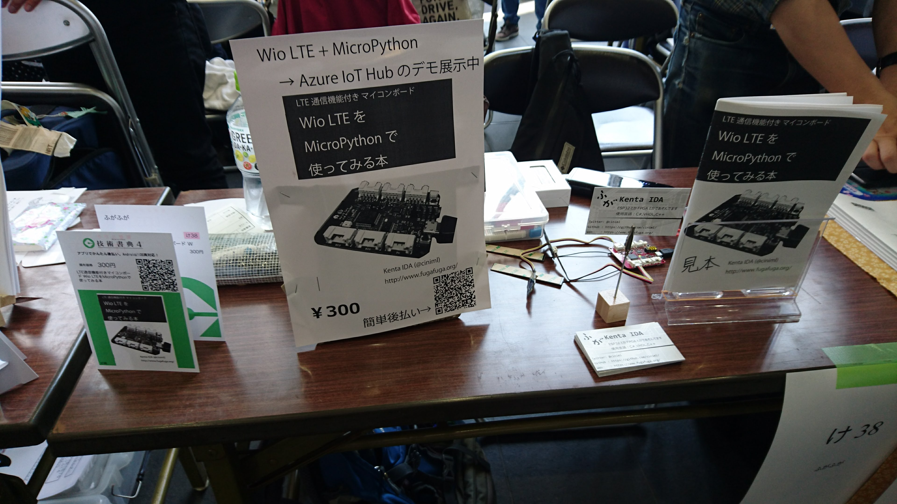
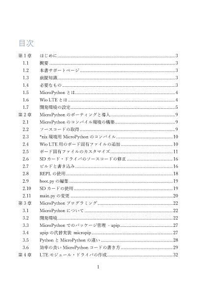
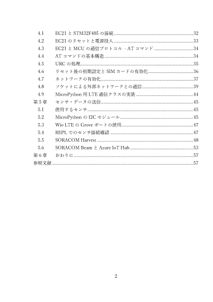

技術書典4出展
===============

概要
------
2018年4月22日に秋葉原のUDXで開催された、技術書典4に出展したのでその経緯と結果について報告する。

頒布物
---------
「Wio LTEをMicroPythonで使ってみる本」というタイトルで、MicroPythonをWio LTEにポーティングして通信するところまでを説明する本を出した。

`BOOTH <https://fugafuga.booth.pm/items/830550>`_ に電子版を出してみたので、興味があれば見ていただければと思う。

準備
------------

前回出展してとても良かったので、今回も出展したいと思い、申し込み開始直後に応募した。

初めは、前回同様ESP32で行こうかと考えていたが、ちょうどWio LTEとMicroPythonで遊んでいたこともあり、Wio LTEネタで行くことにした。

今回は、前回の反省もあり、割と早い目に原稿を書き始め、デモ・プログラムの作成も行っていたが、諸事情により1週間ほど作業できる時間が短くなってしまった。
そのため、結局前回同様、前日まで原稿を書いていた。

ただ、前回の出展の経験があったため、最低限、机の上に置いておくポップ？と名刺は用意できた。

後払い決済については、前回同様、運営側でQRコードと頒布物の写真を印刷したものが用意されていたので、それも併用した。

電子版頒布用のカードは今回も `対面電書 <https://taimen.jp/>`_ を使った。
Illustlatorの変数のデータセット生成は自動化が間に合わなかったので、仕方なく今回も手作業で作成した。

当日
----------

今回は技術書典としては初の晴れの天気だった。

会場には10:15位に着いた。
すでに一般入場者の列ができていた。この時点での並んでいる人数は技術書典2の時と同じくらいだったと思うが、この列の前に並んでいた人は解散させられたという話もあるので、
技術書典2の時よりも人数は増えていたのかもしれない。

一応Wio LTE + MicroPythonで作ったAzure IoT Hubにセンサ・データを投げてPower BIで表示するデモを動かせていたが、いまいち見た目が地味だったので、あまり質問などは来なかった。

Wio LTEに関しては、

* 実際に使っている方は消費電力を下げることに興味を持っている人が多かった。
    * STM32F405RG側がディープ・スリープにならないような話を聞いた。
* 3GやLTEのモジュールを使おうとしたことがある人は、Wio LTEの価格(1万円くらい)を聞いて、「安くなった」という反応。
* そうでない人は、「高い」という反応
    * まあ、RPi + LTEモデムでそれくらいの値段なので、通信するというだけならそうなると思う。
    * 消費電力はどうにもならなさそうだが。
* MicroPythonに関してはあまり反応なし。

という感じだった。

反省点
--------------

今度こそは印刷所で印刷にだしてみたい。

